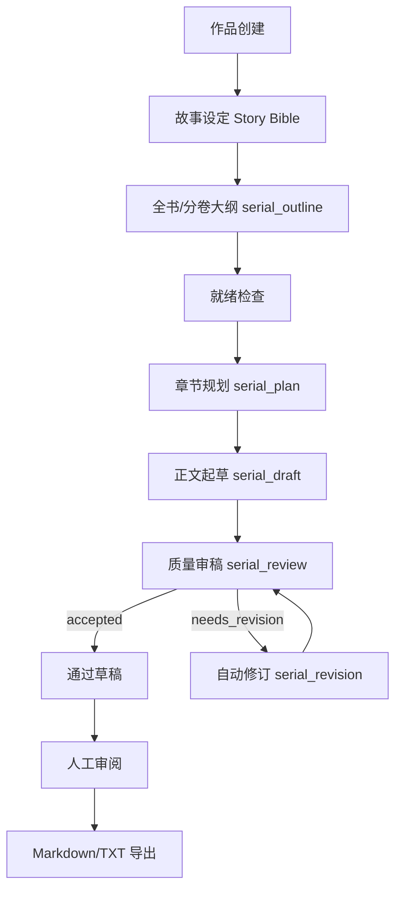

# 提示词与连载工作流

本文档记录 aonarr 当前的提示词边界和自动连载生产链路，用于后续商业化二开、模型调优和人工审稿协作。

## 设计目标

- **原创边界**：所有模板只服务原创长篇网文生产，不复制 PlotPilot 或任何外部作品、提示词、IP 表达。
- **可控生产**：把长篇连载拆成可检查的阶段，而不是一次性让模型自由写完整本书。
- **可追踪质量**：每章都保留计划、草稿、审稿、修订、运行事件和成本估算。
- **可编辑模板**：内置模板只是默认工作流，管理员可以在系统设置里调整提示词。

## 当前工作流



## 模板职责

| 模板 ID | 阶段 | 输入 | 输出 | 质量关注 |
| --- | --- | --- | --- | --- |
| `serial_outline` | 全书/分卷大纲 | 作品、题材、风格目标、目标章数、故事设定、续写上下文 | 分卷 + 章节剧情总结 | 剧情密度、卷级弧线、连续因果、转折、章末推进 |
| `serial_plan` | 章节规划 | 作品、题材、风格目标、章节号、故事设定 | JSON 章节计划 | 章节目标、冲突、钩子、出场角色、上下文依赖 |
| `serial_draft` | 正文起草 | 故事设定、锁定章节计划 | 章节正文 | 场景推进、人物动机、节奏、章节尾钩子 |
| `serial_review` | 质量审稿 | 锁定章节计划、草稿正文 | JSON 审稿结果 | 连续性、目标完成度、冲突强度、文风贴合、是否可通过 |
| `serial_revision` | 自动修订 | 故事设定、锁定章节计划、审稿反馈、旧草稿 | 修订后正文 | 按反馈修复，同时保持章节计划不漂移 |

## 输出契约

`serial_outline` 输出给人读的分卷大纲，格式如下：

```text
第X卷：卷名
第N章 章节标题：用2-5句概括本章剧情推进、冲突、转折和章末钩子。
```

当目标章数很大时，`serial_outline` 可以分批生成，但必须停在完整章节边界，并给出下一章标题提示。

`serial_plan` 必须返回合法 JSON，且只包含：

```json
{
  "title_hint": "章节标题或标题方向",
  "goal": "本章结束时必须改变的故事状态",
  "conflict": "本章主要冲突、压力或代价",
  "hook": "章末钩子",
  "cast_ids": ["cast-id"],
  "context_dependencies": ["必须延续的事实"]
}
```

`serial_review` 必须返回合法 JSON，且只包含：

```json
{
  "quality_score": 8.2,
  "accepted": true,
  "summary": "通过或退回的核心原因",
  "revision_notes": ["需要修复的具体事项"]
}
```

`serial_draft` 和 `serial_revision` 只输出正文，不输出解释、Markdown 围栏、JSON 或大纲。

## 现有源码映射

- 默认模板：`backend/app/services/prompt_templates.py`
- 模板 API：`backend/app/api/prompt_templates.py`
- 工作流执行器：`backend/app/services/serial_engine.py`
- 故事设定模型：`backend/app/models/schemas.py`
- 前端模板编辑：`frontend/src/components/SettingsPage.vue`

## 下一阶段优化建议

1. **增加上下文包**：把上一章摘要、未兑现伏笔、角色状态、地点状态注入模板，避免长篇后期失忆。
2. **增加前置预算检查**：在每次 LLM 调用前根据模板、目标字数和单价预估成本，超过预算则不发起请求。
3. **增加章节评分维度**：把 `serial_review` 的单一总分扩展为节奏、冲突、连续性、文风、钩子五个子分。
4. **增加人工锁定点**：允许用户锁定某章计划或某段正文，后续修订不能改动锁定内容。
5. **增加模板版本号**：运行记录保存使用的模板版本，便于回放和排查质量波动。
